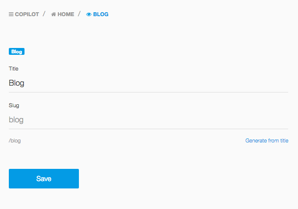
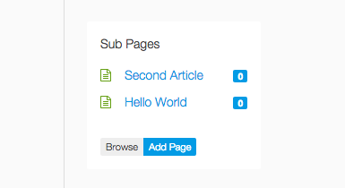
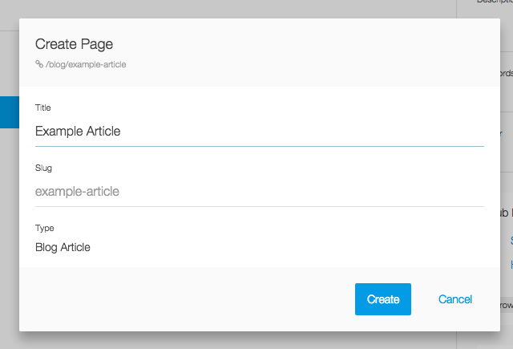
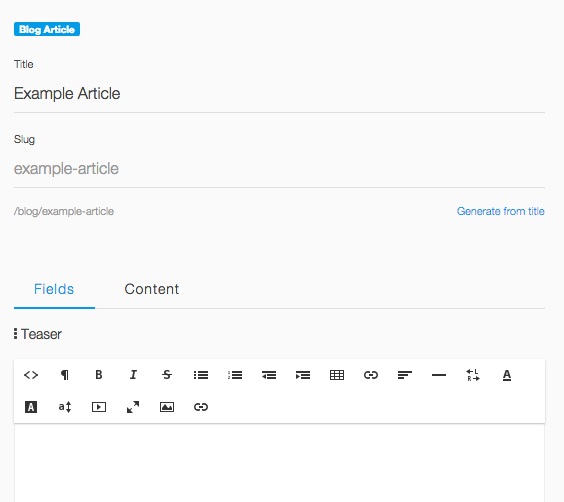
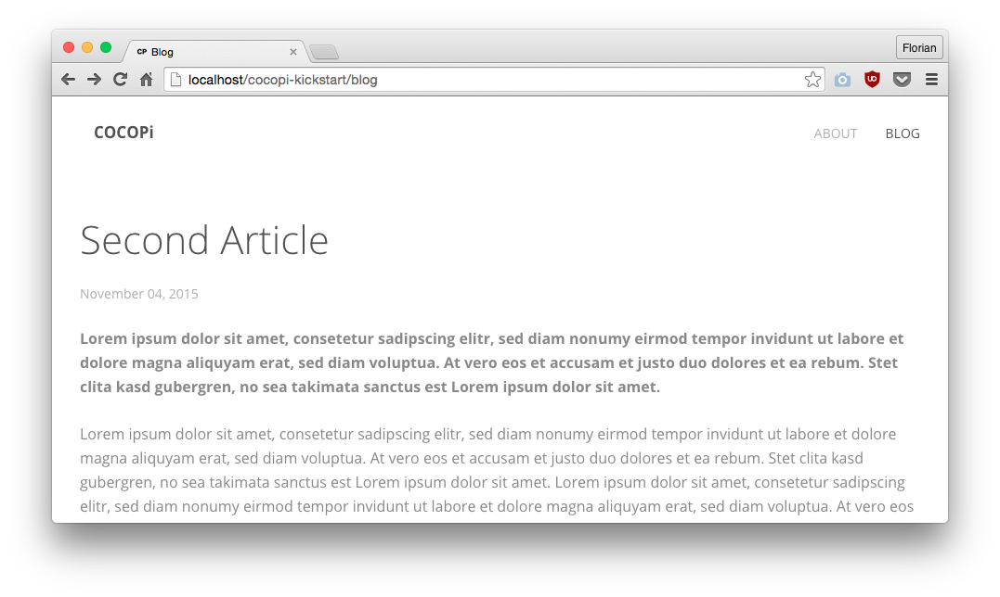

# Create a Blog

Here is an example for a simple blog.

## Content type

Define a content type for your blog which includes a subtype for a blog article. Blog articles are written in Markdown and include a WYSIWYG editor as a teaser text.

`site/types/blog.yaml`:

```
label: Blog
layout: blog
subpages: blog/article
ext: md
content:
    visible: false

subtypes:
    article:
        label: Blog Article
        subpages: false
        layout: blog/article
        ext: md
        content:
            type: markdown

        meta:
            teaser:
                type: wysiwyg
                label: Teaser
```


## The blog is a top level content item

Create a markdown file `content/blog/index.md`. This will create the `/blog` url where we can access the blog in the browser.

```
type: blog
title: Blog
===
```


## A sample content item

Blog articles are now subpages of the top level blog page. You can create create a new blog article from the browser, when you login to the Cockpit backend.

A content item could look like this. It will be available at the url `/blog/hello-world`.

`content/blog/hello-world/index.md`:

```
uid: pid-563954eb0b874
type: blog/article
created: 2015-11-04 00:44:27
modified: 2015-11-04 01:02:46
title: Hello World
teaser: |
  <p>Lorem ipsum dolor sit amet, consetetur sadipscing elitr, sed diam nonumy eirmod tempor invidunt ut labore et dolore magna aliquyam erat, sed diam voluptua.
  </p>

===

Lorem **ipsum dolor** sit amet, consetetur sadipscing elitr, sed diam nonumy eirmod tempor invidunt ut labore et dolore magna aliquyam erat, sed diam voluptua.
```

## Blog layout

Our blog type specified a custom `layout` which is used to render pages of this type.

In the first line, we extend the master layout of the theme and just add our own blog markup. We then fetch all blog articles. Blog articles are subpages (=children) of the blog page. We only want to fetch visible articles and sort them by their created date. And that is exactly when the second line does.

Layouts, like any rendered file in Cocopi, can use PHP or Lexy markup.

`site/layouts/blog.html`:

```
@extend('theme:layout.html')



@foreach($articles as $article)
<article class="uk-article">

    <h1 class="uk-article-title"><a href="{{ $article->url() }}">{{ $article->meta('title') }}</a></h1>

    <div class="uk-article-meta">
        {{ date('F d, Y', strtotime($article->meta('created'))) }}
    </div>

    @if($article->meta('teaser'))
    <div class="uk-margin">
        {{ $article->meta('teaser') }}
    </div>
    @endif

    <div class="uk-margin">
        {{ $article->content() }}
    </div>

</article>
@endforeach
```

## Blog article layout

We need a second layout to render the single view of a blog article.

`site/layouts/blog/article.html`:

```
@extend('theme:layout.html')


<article class="uk-article">

    <h1 class="uk-article-title">{{ $page->meta('title') }}</h1>

    <div class="uk-article-meta">
        {{ date('F d, Y', strtotime($page->meta('created'))) }}
    </div>

    @if($page->meta('teaser'))
    <div class="uk-margin">
        {{ $page->meta('teaser') }}
    </div>
    @endif

    <div class="uk-margin">
        {{ $page->content() }}
    </div>

</article>
```

## The result in the admin area

The `/blog` page is displayed without its content field, because we have hidden the content in the blog type definition.



The sidebar shows all subpages of the blog page. Every blog article is a subpage and appears here. Click *Add Page* to create a new blog article.



A popup appears to create the new subpage. Note how the type *Blog Article* is preselected. Actually you can only select this type here, because this is the only subtype of the blog type.



The resulting editor shows all meta fields (only one wysiwyg field in our case). The content editor is available in the second tab and it is a Markdown editor in our case.



## The rendered blog in the browser


