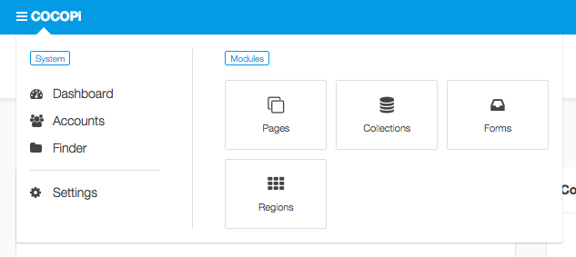
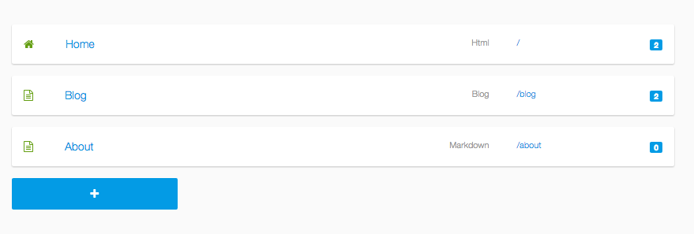
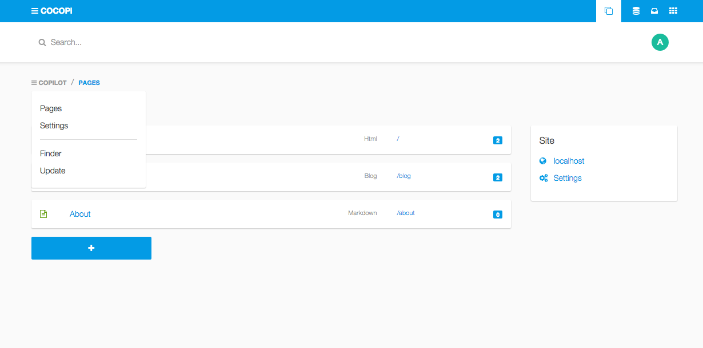
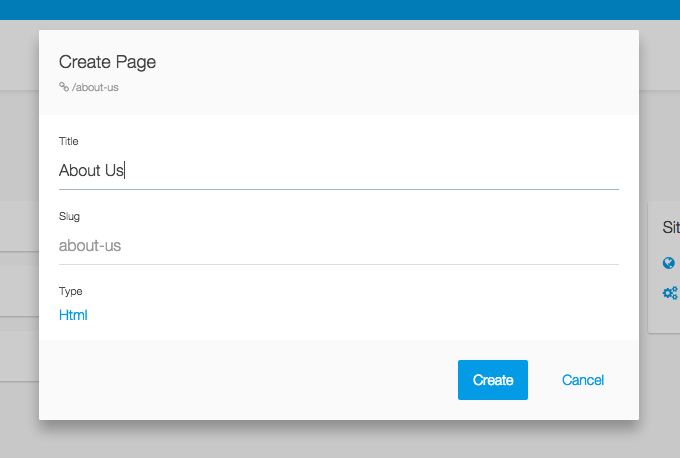
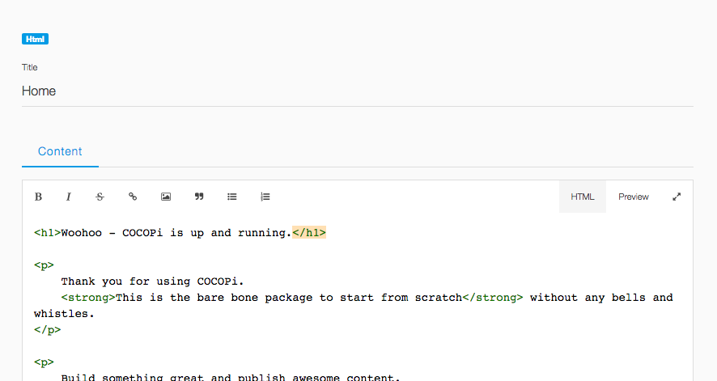
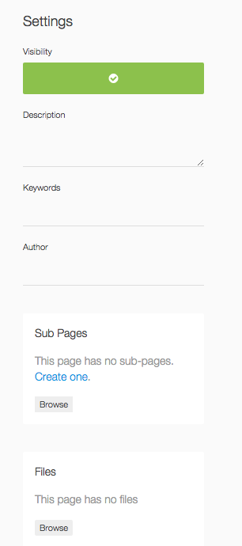
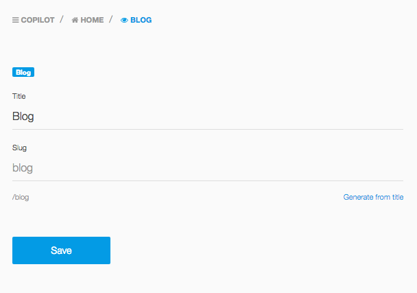
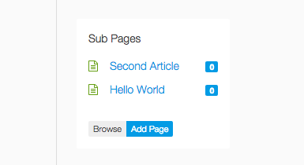
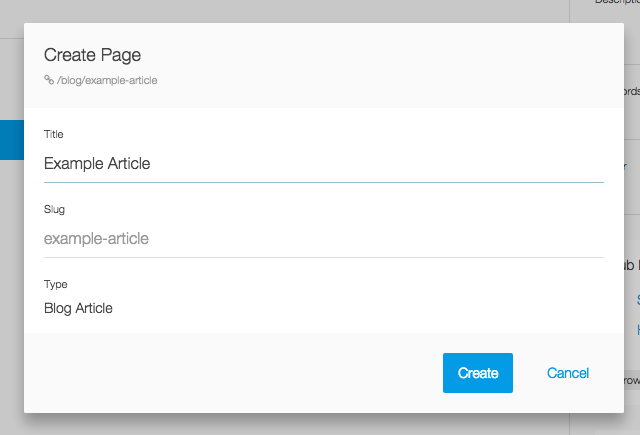
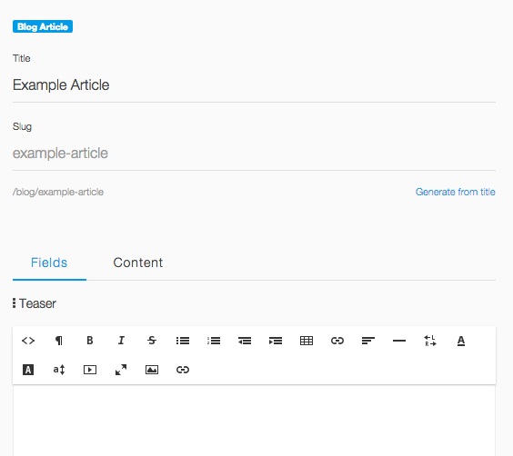

Manage content from the browser
===

Cocopi stores content in flat files, either in `*.md` or `*.html` files. You can edit these files directly. However, what makes Cocopi so attractive (and client-friendly) is the integration in the Cockpit admin area, where you can create content for all your defined content types.

## Cockpit backend

Login to the Cockpit admin area, by appending `/cockpit` to your site's URL. Cockpit offers many features. The section we are interested is can be reached when you hove the main menu icon on the top left. Click the *Pages* menu item.

## Top level pages

The top level pages are everything which is directly located in your `/content` folder. These will appear in the overview.

## Second level menu

Note the second level menu. From here you can always return to the pages overview and access the Finder with nice filtering for the files on your server.

## Creating a new page

In the top level page overvie, click the big blue button with the plus sign, to add a new page. Enter a title and select *Markdown* to create a new page with the content created in Markdown (or HTML, whatever you like).

Have a look at the sidebar. Here you can enter metadata for this page, create subpages and upload files. The files you see here are the located iin the same content folder as this content item. This makes it easy to keep images for your content in the same folders as the content files themselves.

## Creating a blog post

The following screenshots were taken with the [cocopi-kickstart](https://github.com/COCOPi/cocopi-kickstart) package. The structure to achieve a blog like this is described in the [Blog Example](blog.md).

When you click on the *Blog* page, in the top level page overview, you see the Blog page. In contrast to a regular Markdown or HTML page, it is displayed without a content field. This is because we have hidden the content in the blog type definition (see [Blog Example](blog.md))

The sidebar shows all subpages of the blog page. Every blog article is a subpage and appears here. Click *Add Page* to create a new blog article.

A popup appears to create the new subpage. Note how the type *Blog Article* is preselected. Actually you can only select this type here, because this is the only subtype of the blog type.

The resulting editor shows all meta fields of this page. The content editor is available in the second tab and it is a Markdown or HTML editor.

