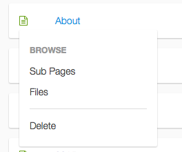
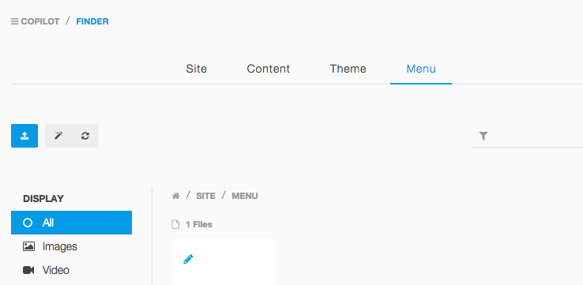

Manage content from the browser
===

Cocopi stores content in flat files, either in `*.md` or `*.html` files. You can edit these files directly. However, what makes Cocopi so attractive (and client-friendly) is the integration in the Cockpit admin area, where you can create content for all your defined content types.

## Cockpit backend

Login to the Cockpit admin area by appending `/cockpit` to your site's URL. Cockpit offers many features. The section we are interested can be reached when you hover the main menu icon on the top left. Click the *Pages* menu item.

## Top level pages

The top level pages are everything which is directly located in your `/content` folder. Click a Page title to edit it.

In the overview of the top lebel pages, you can also hover a page icon to show a submenu. From here you can jump to subpages, list files uploaded for this page or delete the page.

## Second level menu

Note the second level menu in the *Pages* area. From here you can always return to the pages overview and access the Finder. If you access the finder from this submenu, it will show several filters to comfortably manage specific parts of your site (i.e. menu files).

## Creating a new page

In the top level page overvie, click the big blue button with the plus sign, to add a new page. Enter a title and select *Markdown* to create a new page with the content created in Markdown (or HTML, whatever you like).

The HTML and Markdown editor offers syntax highlighting, auto completion and a helpful toolbar to insert images and text formatting elements. You can also simple drag and drop image files from your local system in the editor. The file will be uploaded and included automatically. By default, the editor is in the default *Editing* mode. On the top right, you can switch to a live preview and even a full screen side-by-side view that makes editing really pleasant.

Have a look at the sidebar. Here you can enter metadata for this page, create subpages and upload files. The files you see here are the located in the same content folder as this content item. This makes it easy to keep images for your content in the same folders as the content files themselves.

## Creating a blog post

The following screenshots were taken with the [cocopi-kickstart](https://github.com/COCOPi/cocopi-kickstart) package. The structure to achieve a blog like this is described in the [Blog Example](blog.md).

When you click on the "Blog" page, in the top level page overview, you see a page without a content editor. In contrast to a regular Markdown or HTML page, this *Blog* page is displayed without a content field. We have hidden the content on purpose, inside the blog type definition (see [Blog Example](blog.md)).

The sidebar shows all subpages of the page you are editing. In our blog implementation, every blog article is a subpage of the */blog* page and appears here in the sidebar. Click *Add Page* to create a new blog article.

A popup appears to create the new subpage. Note how the type *Blog Article* is pre-selected. Actually you can only select this type here, because this is the only allowed subtype of the `blog` type definition.

The resulting editor shows all meta fields of this page. The content editor is available in the second tab.

